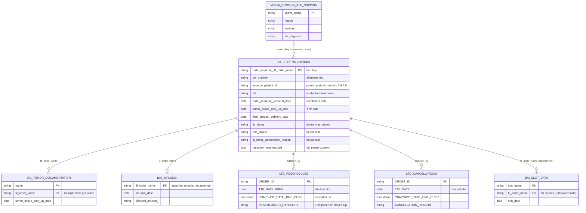

# 01 - Data Model

Sources are manual Excel exports from the Infinity platform today. In the
agreed target architecture the same tables land raw in Redshift and the daily
Glue job reads them there; the model below is identical either way, since the
tables, keys and relationships do not change with the transport. The current
required list comes from `PPR Automation/PIPELINE v2 - design and download
list.md` (2026-08-03), which supersedes the older 7-file list in
`git/PPR/July 27/README.md`.
Retired inputs (Confirmed, PIPELINE v2 section 1): `bai_list_of_orders_hist`
(stale, stops Sep 2025), `bai_ttp_data` (never read by any stage),
`veeva_call_activity` (no longer needed).



## Dataset Grain

Note on numbers in this file: row counts and null rates come from the
real-data schema profile and the live Infinity table notes (2026-08-03),
not from the test sample in this repo. They are
dataset-level only; no per-center values appear in this handoff.

```text
bai_list_of_orders grain:        one row per TIL order (the hub; 2,290 rows in the live Infinity table, notes 2026-08-03)
bai_tumor_documentation grain:   one row per procurement (an order can have several)
bai_infusion grain:              one row per order (subset: infused orders only)
veeva_komodo_atc_mapping grain:  one row per center
LTD_Reschedules grain:           one row per change to a booked TTP date
LTD_Cancellations grain:         one row per cancelled TTP
Intermediate ppr_analysis.csv:   one row per order (children pre-aggregated, never joined row-to-row)
Intermediate ppr_cancellations:  one row per counted short-notice lost-slot event
Final Events (ppr_datewindow):   one row per metric event per scorecard column it falls in,
                                 plus one "Selected window" copy per event, plus benchmark
                                 and zero-stub rows
```
All Confirmed: `SOURCE TO TARGET MAPPING.md`, `DATA LINEAGE - for data engineering.md`,
`pipeline/build_analysis_table.py`, `pipeline/build_datewindow.py`.

## Keys

- **Base dataset:** `bai_list_of_orders`. Confirmed: "the hub, one row per TIL
  order" (`SOURCE TO TARGET MAPPING.md` Part A).
- **Expected unique key (base):** `order_request__til_order_name`
  (`coi_number` alternate). Confirmed.
- **Join keys:** `til_order_name` / `ORDER_ID` to every child table;
  `center_key` (normalized name: lowercased, legal suffixes and punctuation
  stripped) to the Veeva mapping. Confirmed.
- **Patient key:** `iovance_patient_id` (a hash; used for the four
  patient-distinct metrics). Confirmed.
- **Deduplication key:** the Veeva mapping is deduplicated on `center_key`
  (keep first) before its left join. Confirmed:
  `pipeline/build_analysis_table.py:199`.
- **Final dataset unique key:** none by design (see README contract).

## Relationship Summary

| Left dataset | Right dataset | Join fields | Cardinality | Join type | Risk |
| ------------ | ------------- | ----------- | ----------- | --------- | ---- |
| bai_list_of_orders | bai_tumor_documentation | order_request__til_order_name = til_order_name | 1 to 0..N (1,126 rows over 869 orders) | Aggregated to per-order counts (no row join) | None: collapse to `tpf_count` prevents row multiplication. Confirmed |
| bai_list_of_orders | bai_infusion | order_request__til_order_name = til_order_name | 1 to 0..1 | Index map (no row join) | Uniqueness of the infusion key is assumed, not asserted; a duplicate key would break the map. Inferred risk: `build_analysis_table.py:188-194` |
| bai_list_of_orders | veeva_komodo_atc_mapping | center_key (normalized free-text name) | N to 0..1 | LEFT join after dedup | Fuzzy name match: ~6 of 85 centers unmatched, arriving with null region/segment/territory. Confirmed: PIPELINE v2 item 8 |
| bai_list_of_orders | LTD_Reschedules | order_request__til_order_name = ORDER_ID | 1 to 0..N | Lookup to attach center | Events whose ORDER_ID is not in the orders extract are warned and EXCLUDED from metric 3. Confirmed: `build_cancellations.py:84-88` |
| bai_list_of_orders | LTD_Cancellations | order_request__til_order_name = ORDER_ID | 1 to 0..N (per-order multiplicity unverified) | Lookup to attach center | Same exclusion risk as reschedules; cardinality per order TBD |
| bai_list_of_orders | bai_slot_data | order_request__til_order_name = til_order_name | 1 to 0..N | Membership flag only (`has_slot`) | None: diagnostic flag, drives no metric. Confirmed: `data/README.md` |

Row multiplication is designed out of the pipeline: children are aggregated or
mapped, never merged row-to-row, and the only true join is against a
deduplicated one-row-per-center mapping. Confirmed:
`build_analysis_table.py:177-202`. The final Events table multiplies rows
deliberately (one copy per column bucket); that fan-out is reconciled
cell-by-cell against the independently computed scorecard on every run.
Confirmed: `build_datewindow.py:316-350`.

## TWBX Verification Items

Data-model details that only the production workbook can settle:

- Whether the workbook connects only to `ppr_datewindow.hyper` (Events) or
  also to `ppr_scorecard.hyper` / `ppr_analysis.hyper`, which are written every
  run but per the docs not read by the dashboard.
- Live-to-hyper vs published extract, and any extract filters.
- Any Tableau relationships, blends, or joins added on top of the single table.
- Referential-integrity / performance settings if multiple sources are related.
- Hidden fields or Tableau-side logical tables not described in the build doc.
