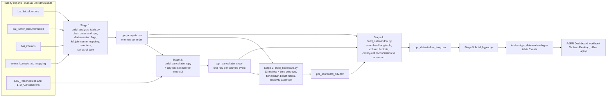

# 02 - Data Flow

One Python runner (`git/PPR/July 27/RUN_ALL.py`) executes six stages in order
and stops on the first failure. Everything below is Confirmed from the stage
scripts unless labeled otherwise.

Target-state note (agreed 2026-08-03): the same six stages run unchanged
inside the daily Glue job. The inputs come from the raw tables in Redshift
instead of downloaded files, the Events output additionally lands back in
Redshift as `ppr.ppr_events`, and Tableau refreshes from that table only
after the job succeeds. The processing in between is identical, so the steps
below describe both worlds.

## The flow in 10 steps

1. **Resolve inputs and as-of.** Stage 1 reads the Excel exports from
   `PPR_INPUT_DIR`, else `data/` (headers on spreadsheet row 3; filenames
   matched by substring). The as-of date is `max(order_request__created_date)`
   from the orders file (a `PPR_ASOF` env var can override it), never the
   clock, and is written to `analysis/run_meta.json` for every later stage.
   Input: 4 core exports. Output: parsed frames plus the as-of date.
2. **Clean and derive at order grain.** Renames the three working dates,
   nulls out invalid ZIPs, collapses tumor rows to per-order counts, maps
   infusion fields by order key, and derives the boolean metric flags
   (completed/scheduled TTP, OOS, mfg started, drop-out categories). No child
   table is row-joined, so the order grain cannot multiply.
3. **Attach center attributes and tiers.** Left join to the Veeva mapping on a
   normalized center name (mapping deduplicated first); rank centers by
   distinct orders into Top 10 / Top 40 / Other, with "New" proxied as first
   enrollment year 2025 or later. Output: `analysis/ppr_analysis.csv`, one row
   per order.
4. **Count metric-3 events.** Stage 2 applies the one shared rule to the LTD
   exports (falling back to the snapshot history, then to a per-order proxy
   flag, recording which source was used in `run_meta.json`): an event counts
   when a booked TTP slot was lost with 0-7 days notice; events join back to
   orders for their center. Output: `analysis/ppr_cancellations.csv`, one row
   per counted event, with a drop funnel that must reconcile.
5. **Compute the scorecard.** Stage 3 computes all 13 metrics per center for
   each template column (Launch to Date, 2024, 2025, 2026 YTD, four quarters,
   plus Undated and After as-of), windowing every metric on its own event
   date. Benchmark columns are per-center medians within tier. A hard
   assertion requires the period columns to sum back to Launch to Date for
   additive metrics. Output: `analysis/ppr_scorecard_tidy.csv`.
6. **Build the event table Tableau consumes.** Stage 4 re-expresses every
   metric as dated events, emitting each event once per column bucket plus a
   "Selected window" copy (the only copy the date parameters filter), and
   appends pre-aggregated benchmark rows and zero-value stubs.
7. **Reconcile the two implementations.** Stage 4 re-aggregates its own event
   table and compares every cell against the stage-3 scorecard; the build
   stops on any disagreement except one documented 2nd-resections dedup edge.
   Output: `analysis/ppr_datewindow_long.csv`.
8. **Write the Tableau extracts.** Stage 5 writes
   `tableau/ppr_datewindow.hyper` (table `Events`) - the dashboard's source -
   plus `ppr_scorecard.hyper` and `ppr_analysis.hyper` as reference/advanced
   sources.
9. **Render the no-Tableau fallback.** Stage 6 inlines the scorecard payload
   into `dashboard/ppr_scorecard.html`, a self-contained page mirroring the
   same metric logic (its M3 window mode still uses the proxy flag - a known
   implementation difference).
10. **Refresh Tableau.** On the office laptop: close Tableau while the
    pipeline runs (it locks the .hyper files), reopen the workbook, and
    refresh each data source. The workbook itself never changes on refresh.
